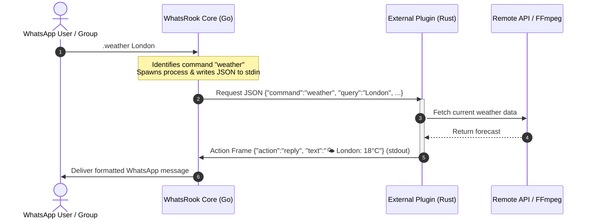

# WhatsRook External Plugins

  

  <em>The official suite of high-performance, standalone external plugins and SDK for <a href="https://github.com/Thruqe/whatsrook">WhatsRook</a>.</em>

  
  
  
  

---

## What are External Plugins?

**WhatsRook External Plugins** are independent native binaries—predominantly authored in [Rust](https://www.rust-lang.org/)—that extend WhatsRook with rich utilities, media transformers, AI services, and financial tracking without modifying or recompiling the core bot.

Communication between the host bot and external plugins is conducted over standard I/O streams (`stdin` / `stdout`) using a lightweight, newline-delimited JSON IPC protocol mediated by [`whatsrook-sdk`](sdk.md).

---

## Architectural Advantages

=== "⚡ Process Isolation"
    Each external command runs inside its own isolated operating system process. If a plugin encounters an unexpected edge-case, crashes, or panics, the core WhatsRook engine remains completely unaffected and fully operational.

=== "🚀 Zero-Downtime Hot-Swapping"
    Plugins can be dynamically installed, upgraded, or uninstalled straight from WhatsApp chats using `.install <plugin>` or `.uninstall <plugin>`. No bot restarts, no connection drops, and zero downtime.

=== "🦀 Memory Safety & Pure Speed"
    Authored in Rust with full link-time optimization (`lto = true`) and zero-cost abstractions, each plugin starts in sub-millisecond time and executes with minimal CPU and RAM overhead.

=== "📦 Multi-Platform Portability"
    Every release compiles identical functionality into standalone static/musl binaries across Linux (x86_64, aarch64), macOS (Intel, Apple Silicon), and Windows.

---

## Architectural Comparison

| Capability | Built-in Core (Go) | External Plugins (Rust) |
| :--- | :--- | :--- |
| **Execution Context** | Single monolithic bot process | Sandboxed ephemeral child process |
| **Installation** | Requires binary recompile & restart | **Hot-installed dynamically via WhatsApp** |
| **Fault Blast Radius** | Panics can crash WhatsApp connection | **Crashes isolated to child process only** |
| **Language Support** | Go only | **Rust, C, Python, Node, Shell, etc.** |
| **Media Operations** | In-process memory buffers | Native FFmpeg pipeline / child pipes |
| **Deployment Size** | Core binary size increases | Distributed as modular standalone crates |

---

## Ecosystem Navigation

-   :material-download: **[Installation Guide](installation.md)**
    
    ---
    
    Dynamic 1-click installation via chat, prebuilt platform archives, Docker workflows, and Cargo source compilation.

-   :material-swap-horizontal: **[Architecture & Protocol](protocol.md)**
    
    ---
    
    Deep dive into the stdin/stdout newline-delimited JSON IPC wire format, request models, action frames, and ACK lifecycles.

-   :material-view-grid: **[Plugin Catalog](plugins.md)**
    
    ---
    
    Complete reference, syntax, options, and live output previews for all **29 official plugins**.

-   :material-hammer-wrench: **[SDK & Development](sdk.md)**
    
    ---
    
    Tutorial and reference for building custom plugins with [`whatsrook-sdk`](https://crates.io/crates/whatsrook-sdk) on crates.io.

-   :material-help-circle: **[Troubleshooting & FAQ](troubleshooting.md)**
    
    ---
    
    Permission fixes, FFmpeg dependencies, manual CLI debugging techniques, and common error resolutions.

