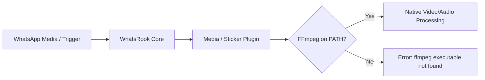

# Installation & Deployment

WhatsRook external plugins offer three distinct installation methods tailored to your environment:

1. **[Dynamic In-Chat Installation](#1-dynamic-in-chat-installation)** — Zero-downtime, platform-aware installation directly within WhatsApp chats.
2. **[Prebuilt Binary Archives](#2-prebuilt-binary-archives)** — Download precompiled release tarballs for your OS/architecture.
3. **[Compiling from Source](#3-compiling-from-source)** — Build the full 29-crate Rust workspace with optimized Link-Time Optimization (LTO).

---

## 1. Dynamic In-Chat Installation

The most direct way to install plugins is via WhatsRook's built-in, platform-aware package manager. Any configured bot **Owner** or **Sudo** user can execute installation commands in any private or group chat.

### Platform-Aware Auto Resolution

WhatsRook identifies the host OS (`linux`, `darwin`, `windows`) and CPU architecture (`amd64`, `arm64`), fetching the verified binary release asset from GitHub automatically:

```text
.install <plugin-name>
```

???+ example "Installing Individual Plugins"
    ```text
    .install weather
    .install calc
    .install btc
    .install news
    .install why
    ```

### Install All Official Plugins

To download, verify, and register all 29 official plugins simultaneously:

```text
.install all
```

!!! tip "Automatic Permission Setup"
    On Unix-like platforms (Linux and macOS), WhatsRook automatically marks the downloaded binary executable with `chmod +x` upon saving to the plugins directory.

### Custom URLs or Local Binaries

You can also register custom or private binaries by providing a remote HTTP/HTTPS URL or an absolute local filesystem path:

```text
.install myplugin https://releases.example.com/bin/myplugin-linux-amd64
.install customtool /opt/custom_plugins/customtool
```

---

## 2. Prebuilt Binary Archives

All official plugins are compiled on GitHub Actions for every major OS and architecture and published on the [GitHub Releases](https://github.com/Thruqe/whatsrook-externals/releases) page.

| Target Platform | Architecture | Archive Format | File Name |
| :--- | :--- | :--- | :--- |
| **Linux (glibc)** | `x86_64` (amd64) | `.tar.gz` | `whatsrook-externals-linux-amd64.tar.gz` |
| **Linux (ARM64)** | `aarch64` (arm64) | `.tar.gz` | `whatsrook-externals-linux-arm64.tar.gz` |
| **Linux (musl static)** | `x86_64` (Alpine) | `.tar.gz` | `whatsrook-externals-linux-musl-amd64.tar.gz` |
| **macOS Apple Silicon** | `aarch64` (M1–M4) | `.tar.gz` | `whatsrook-externals-darwin-arm64.tar.gz` |
| **macOS Intel** | `x86_64` (Intel) | `.tar.gz` | `whatsrook-externals-darwin-amd64.tar.gz` |
| **Windows** | `x86_64` (64-bit) | `.zip` | `whatsrook-externals-windows-amd64.zip` |

### Manual Archive Extraction

=== "Linux (Debian / Ubuntu / Arch)"
    ```bash
    # Create the default plugins directory if it does not exist
    mkdir -p ~/.whatsrook/plugins

    # Download and extract the archive directly into the plugins folder
    curl -fsSL https://github.com/Thruqe/whatsrook-externals/releases/latest/download/whatsrook-externals-linux-amd64.tar.gz | tar -xz -C ~/.whatsrook/plugins/

    # Ensure executable permissions
    chmod +x ~/.whatsrook/plugins/*
    ```

=== "Alpine Linux / musl (Docker)"
    ```bash
    mkdir -p ~/.whatsrook/plugins
    curl -fsSL https://github.com/Thruqe/whatsrook-externals/releases/latest/download/whatsrook-externals-linux-musl-amd64.tar.gz | tar -xz -C ~/.whatsrook/plugins/
    chmod +x ~/.whatsrook/plugins/*
    ```

=== "macOS (Apple Silicon & Intel)"
    ```bash
    mkdir -p ~/.whatsrook/plugins
    # For Apple Silicon (M1/M2/M3/M4):
    curl -fsSL https://github.com/Thruqe/whatsrook-externals/releases/latest/download/whatsrook-externals-darwin-arm64.tar.gz | tar -xz -C ~/.whatsrook/plugins/
    chmod +x ~/.whatsrook/plugins/*
    ```

=== "Windows (PowerShell)"
    ```powershell
    $dest = "$HOME\.whatsrook\plugins"
    New-Item -ItemType Directory -Force -Path $dest

    $zipPath = "$env:TEMP\whatsrook-externals.zip"
    Invoke-WebRequest -Uri "https://github.com/Thruqe/whatsrook-externals/releases/latest/download/whatsrook-externals-windows-amd64.zip" -OutFile $zipPath

    Expand-Archive -Path $zipPath -DestinationPath $dest -Force
    Remove-Item $zipPath
    ```

---

## 3. Compiling from Source

Building from source allows you to apply custom compiler flags, audit dependencies, or compile for unsupported target architectures (e.g. `riscv64`, `armv7`).

### Build Requirements

- **Rust Toolchain**: Stable version `1.75+` (Rust `1.85+` recommended).
- **Cargo**: Bundled with Rust via [rustup.rs](https://rustup.rs/).
- **C Compiler**: `gcc` or `clang` for crates utilizing native C bindings.

### Build Steps

```bash
# 1. Clone the repository
git clone https://github.com/Thruqe/whatsrook-externals.git
cd whatsrook-externals

# 2. Compile all 29 member crates in release mode
cargo build --release --workspace
```

The resulting binaries will reside in `target/release/`:

```text
target/release/
├── btc             ├── fancy           ├── mp4url          ├── take
├── calc            ├── font            ├── news            ├── tts
├── captcha         ├── fonts           ├── qrcode          ├── urban
├── circle          ├── git             ├── quotes          ├── wabeta
├── cpu             ├── joke            ├── rizz            ├── weather
├── crop            ├── markets         ├── shorturl        └── why
├── fact            ├── media           ├── ss
└── memory          ├── sticker
```

Copy the binaries to your WhatsRook plugin directory:

```bash
cp target/release/{weather,calc,btc,news,sticker} ~/.whatsrook/plugins/
```

---

## 4. System Prerequisites

While most plugins are completely self-contained statically linked binaries, media-processing plugins depend on `ffmpeg` for transcoding, metadata injection, and frame rendering:



### Affected Plugins

- **`.sticker`**, **`.circle`**, **`.crop`**, **`.take`**: WebP conversion, letterbox padding, and EXIF sticker pack tagging.
- **`.media`**: Video-to-audio extraction, audio trimming, format conversion.
- **`.captcha`**: Animated dial dial-code video generation.
- **`.mp4url`**: Video stream processing.

### Installing FFmpeg

=== "Debian / Ubuntu"
    ```bash
    sudo apt update && sudo apt install -y ffmpeg
    ```

=== "Arch Linux"
    ```bash
    sudo pacman -S ffmpeg
    ```

=== "Alpine Linux"
    ```bash
    apk add --no-cache ffmpeg
    ```

=== "macOS (Homebrew)"
    ```bash
    brew install ffmpeg
    ```

=== "Windows (Winget / Scoop)"
    ```powershell
    winget install Gyan.FFmpeg
    # or: scoop install ffmpeg
    ```

---

## 5. File System Layout & Management

By default, WhatsRook organizes runtime data and external plugin executables under:

```text
~/.whatsrook/
├── whatsrook.db           # SQLite database
├── session.json           # WhatsApp multi-device authentication credentials
└── plugins/               # External plugin executable directory
    ├── weather            # (executable)
    ├── calc               # (executable)
    ├── sticker            # (executable)
    └── btc                # (executable)
```

!!! info "Overriding Data Directory"
    You can customize the base directory by configuring the environment variable:
    ```bash
    export WHATSROOK_DATA_DIR="/opt/whatsrook"
    ```
    WhatsRook will then scan `/opt/whatsrook/plugins/` for executable binaries.

### Lifecycle Commands

Manage your installed plugin registry dynamically via WhatsApp:

```text
.plist                 # List all currently installed external plugins
.uninstall <plugin>    # Remove a specific plugin binary
.uninstall all         # Remove all installed external plugins
```
