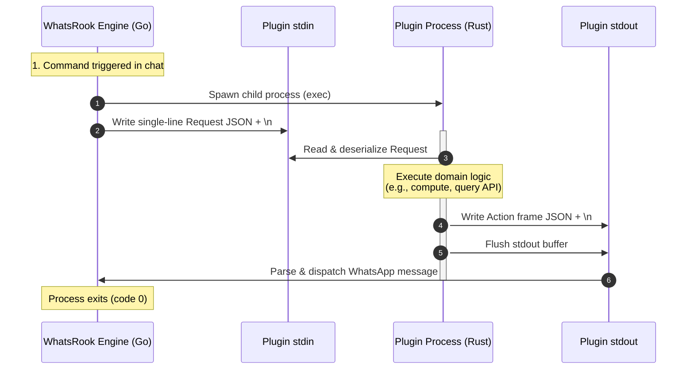
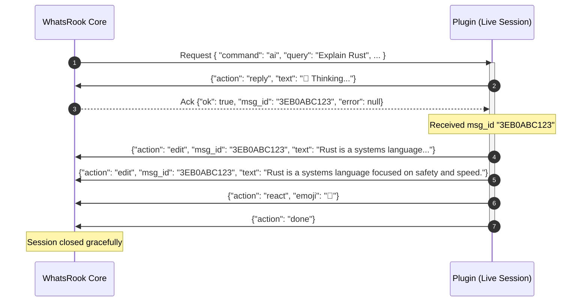

# Architecture & IPC Protocol

WhatsRook external plugins communicate with the host bot via a high-speed, newline-delimited JSON (NDJSON) Inter-Process Communication (IPC) protocol conducted over standard input (`stdin`) and standard output (`stdout`).

This decoupled design adheres strictly to the Unix philosophy: plugins are self-contained standalone executables that can be written, tested, and audited in isolation.

---

## Process Lifecycle

When a user in a WhatsApp chat triggers a command mapped to an external plugin (e.g. `.calc 2^10`), WhatsRook executes the following lifecycle:



1. **Process Launch**: WhatsRook executes the binary residing in `~/.whatsrook/plugins/<command>`.
2. **Request Dispatch**: A single JSON line containing the [`Request`](#request-payload-specification) context is written to the child process's `stdin`.
3. **Execution**: The plugin reads the request, executes its business logic, and emits one or more [`Action`](#action-frames-reference) frames to `stdout`.
4. **Action Handling**: WhatsRook parses incoming action frames line-by-line and executes the corresponding WhatsApp network calls.
5. **Termination**: For one-shot commands, the process terminates immediately. For streaming/live commands, the process remains active until emitting an `Action::Done` frame or until the timeout budget expires.

---

## Live Streaming & The ACK Loop

For dynamic interactions—such as progress tickers, AI token streaming, or multi-step tasks—plugins utilize live sessions.

In a live session, WhatsRook sends back an **Acknowledgment (`Ack`)** payload on `stdin` after message-generating actions (e.g. `reply`). This enables the plugin to capture the generated WhatsApp `msg_id` and modify that message in-place using `edit`.



---

## Request Payload Specification

WhatsRook delivers the request payload as a serialized JSON object on `stdin`. Below is the complete field breakdown:

```json
{
  "command": "weather",
  "args": ["London", "--metric"],
  "raw_args": "London --metric",
  "chat": "120363024817294821@g.us",
  "sender": "447123456789@s.whatsapp.net",
  "prefix": ".",
  "bot_name": "WhatsRook",
  "push_name": "Alex",
  "is_group": true,
  "is_sudo": false,
  "is_owner": false,
  "is_admin": true,
  "live_session": false,
  "is_cancel_request": false,
  "quoted_message": {
    "id": "3EB0123456789ABCDEF",
    "sender": "447987654321@s.whatsapp.net",
    "text": "What is the forecast?"
  },
  "mentioned_jids": [
    "447987654321@s.whatsapp.net"
  ]
}
```

### Field Definitions

| Field | Type | Description |
| :--- | :--- | :--- |
| `command` | `string` | The registered command trigger name (e.g. `"weather"`). |
| `args` | `string[]` | Whitespace-split argument tokens following the command. |
| `raw_args` | `string` | Exact unparsed argument string following the command. |
| `chat` | `string` | WhatsApp JID of the chat where the command occurred (`@s.whatsapp.net` or `@g.us`). |
| `sender` | `string` | WhatsApp JID of the user who sent the command. |
| `prefix` | `string` | The active command prefix (e.g. `"."` or `"!"`). |
| `bot_name` | `string` | Configured display name of the WhatsRook bot instance. |
| `push_name` | `string` | Display name of the sender from their WhatsApp profile. |
| `is_group` | `boolean` | `true` if triggered within a group chat. |
| `is_sudo` | `boolean` | `true` if the sender is an authorized sudoer or owner. |
| `is_owner` | `boolean` | `true` if the sender is the primary bot owner. |
| `is_admin` | `boolean` | `true` if the sender is an admin in the triggering group. |
| `live_session` | `boolean` | `true` if a live session is currently ongoing for this command in this chat. |
| `is_cancel_request`| `boolean` | `true` if the user triggered `.cancel` to abort the active live session. |
| `quoted_message` | `object?` | Context of the replied-to message, if triggered as a quote reply. |
| `mentioned_jids` | `string[]` | List of user JIDs @mentioned in the command message. |

---

## Action Frames Reference

Each action emitted by a plugin must be serialized as a single-line JSON object tagged with an `"action"` field:

### 1. `reply`
Sends a text reply to the chat. In a live session, WhatsRook writes an [`Ack`](#acknowledgment-payload) back to the plugin with the created message ID.

```json
{
  "action": "reply",
  "text": "Hello, world!"
}
```

### 2. `edit`
Edits an existing WhatsApp message in-place using its `msg_id`.

```json
{
  "action": "edit",
  "msg_id": "3EB04F1829D47",
  "text": "Updated message content"
}
```

### 3. `react`
Reacts to a message with an emoji. If `msg_id` is omitted, it reacts to the triggering command message.

```json
{
  "action": "react",
  "msg_id": "3EB04F1829D47",
  "emoji": "🔥"
}
```

### 4. `delete`
Revokes (deletes for everyone) a sent message by its ID.

```json
{
  "action": "delete",
  "msg_id": "3EB04F1829D47"
}
```

### 5. `send_image`
Transmits an image. The `data` field accepts either an HTTP/HTTPS URL or a `base64` encoded byte string.

```json
{
  "action": "send_image",
  "data": "https://example.com/chart.png",
  "caption": "Quarterly Financial Overview",
  "mimetype": "image/png"
}
```

### 6. `send_audio`
Transmits audio. Set `ptt: true` to send as a WhatsApp push-to-talk voice note.

```json
{
  "action": "send_audio",
  "data": "https://example.com/speech.mp3",
  "mimetype": "audio/ogg; codecs=opus",
  "ptt": true
}
```

### 7. `send_video`
Transmits a video file. Set `gif_playback: true` to display as an auto-looping GIF.

```json
{
  "action": "send_video",
  "data": "https://example.com/animation.mp4",
  "caption": "Demo Video",
  "gif_playback": false
}
```

### 8. `send_document`
Sends a document attachment with an explicit file name.

```json
{
  "action": "send_document",
  "data": "data:application/pdf;base64,JVBERi0xLjQK...",
  "filename": "Summary_Report.pdf",
  "caption": "Exported PDF Report"
}
```

### 9. `send_sticker`
Sends a WebP sticker. Media must be valid WebP format (typically 512×512 pixels).

```json
{
  "action": "send_sticker",
  "data": "https://example.com/sticker.webp"
}
```

### 10. `poll`
Creates an interactive WhatsApp voting poll (up to 12 choices).

```json
{
  "action": "poll",
  "question": "Which programming language do you prefer?",
  "options": ["Rust", "Go", "TypeScript", "Python"],
  "selectable": 1
}
```

### 11. `loader`
Displays or updates a temporary typing/processing status banner.

```json
{
  "action": "loader",
  "text": "Generating high-resolution render..."
}
```

### 12. `done`
Explicitly informs WhatsRook that the plugin has finished execution and all session resources should be closed.

```json
{
  "action": "done"
}
```

---

## Acknowledgment Payload

When an action requiring confirmation is emitted (primarily `reply`), WhatsRook delivers an `Ack` back onto `stdin`:

```json
{
  "ok": true,
  "msg_id": "3EB04F1829D47",
  "error": null
}
```

If the action fails (e.g. rate limit, network failure, or permission error):

```json
{
  "ok": false,
  "msg_id": null,
  "error": "failed to send message: network timeout"
}
```

---

## Execution Constraints & Best Practices

!!! warning "Always Flush Standard Output"
    Because WhatsRook reads `stdout` line-by-line in real time, failing to flush stdout will cause frames to buffer in memory and delay delivery. In Rust:
    ```rust
    use std::io::{self, Write};
    println!("{}", json);
    io::stdout().flush().unwrap();
    ```
    [`whatsrook-sdk`](sdk.md) handles this automatically for all helpers.

!!! note "Timeouts & Resource Limits"
    WhatsRook imposes execution timeouts to prevent orphaned or hanging processes:
    
    - **One-Shot Commands**: Default timeout is **30 seconds**.
    - **Live Sessions**: Can stream updates for up to **5 minutes**.
    - If a plugin exceeds its timeout, WhatsRook transmits `SIGTERM`, followed by `SIGKILL` after 2 seconds.
