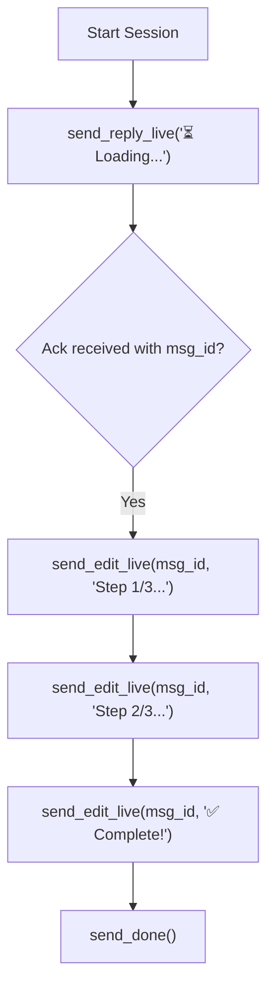

# Plugin Development with `whatsrook-sdk`

The [`whatsrook-sdk`](https://crates.io/crates/whatsrook-sdk) crate provides the official Rust framework for developing high-performance external plugins for WhatsRook.

---

## SDK Overview & Philosophy

Writing a WhatsRook plugin requires zero knowledge of the underlying WhatsApp Web socket protocol or Signal cryptography. The SDK abstracts the IPC communication layer, providing:

- **Type-safe deserialization** of incoming requests.
- **Convenient helpers** for one-shot responses, interactive live editing, and media dispatch.
- **Terminal testing fallbacks** allowing you to run and debug your plugin from your standard shell without running WhatsRook.

---

## 1. Quick Start: Your First Plugin

### Step 1: Create a New Binary Crate

```bash
cargo new --bin hello-plugin
cd hello-plugin
```

### Step 2: Add Dependencies

Add `whatsrook-sdk` to your `Cargo.toml`:

```toml
[package]
name = "hello-plugin"
version = "0.1.0"
edition = "2021"

[dependencies]
whatsrook-sdk = "0.1"

[profile.release]
opt-level = 3
lto = true
codegen-units = 1
panic = "abort"
strip = true
```

### Step 3: Write Plugin Logic

Open `src/main.rs`:

```rust
use whatsrook_sdk::{respond, Request};

fn main() {
    // Read the incoming request context from stdin
    let req = Request::load();
    let query = req.query();

    if query.is_empty() {
        respond(format!("Usage: {}hello <name>", req.prefix()));
        return;
    }

    respond(format!("👋 Hello, *{}*! Welcome to WhatsRook.", query));
}
```

### Step 4: Build & Install

```bash
cargo build --release

# Install locally via WhatsApp chat:
.install hello /path/to/hello-plugin/target/release/hello-plugin
```

---

## 2. Working with `Request`

Calling `Request::load()` parses the incoming JSON line from `stdin`. If executed in an interactive terminal (e.g. during local testing), it automatically generates a mock request from CLI arguments:

```rust
use whatsrook_sdk::Request;

fn main() {
    let req = Request::load();

    // Query & arguments
    let query = req.query();            // Trimmed argument string
    let args = &req.args;               // Whitespace-split arguments
    let prefix = req.prefix();          // Active bot prefix (e.g. ".")

    // Environment & metadata
    let bot_name = req.bot_name();      // "WhatsRook"
    let push_name = req.push_name();    // User's display name
    let is_group = req.is_group();      // Group vs private chat

    // Permissions
    if !req.is_sudo() && !req.is_owner() {
        whatsrook_sdk::respond_err("⛔ Permission denied: Sudoers only.");
        return;
    }
}
```

### Accessing Quoted Messages

When a user replies to an existing message in WhatsApp, `req.quoted_message` contains that message's context:

```rust
if let Some(quoted_text) = req.quoted_text() {
    respond(format!("You replied to: {}", quoted_text));
} else {
    respond("Please reply to a message with this command.");
}
```

---

## 3. Communication Patterns

### Pattern A: Simple One-Shot Response

For standard utility commands that return a single response, use `respond()` or `respond_err()`:

```rust
use whatsrook_sdk::{respond, respond_err, Request};

fn main() {
    let req = Request::load();
    match do_work(&req.query()) {
        Ok(result) => respond(result),
        Err(err) => respond_err(format!("Operation failed: {}", err)),
    }
}
```

### Pattern B: Live Streaming & In-Place Editing

For long-running tasks, progress indicators, or live price tickers, use the live session workflow:



```rust
use std::thread::sleep;
use std::time::Duration;
use whatsrook_sdk::{send_done, send_edit_live, send_reply_live, Request};

fn main() {
    let req = Request::load();

    // Send the initial placeholder message and receive its WhatsApp message ID
    let Some(msg_id) = send_reply_live("⏳ *Processing query...*") else {
        return;
    };

    // Simulate work progression
    for step in 1..=3 {
        sleep(Duration::from_millis(1200));
        send_edit_live(&msg_id, &format!("⏳ *Processing step {}/3...*", step));
    }

    sleep(Duration::from_millis(800));
    send_edit_live(&msg_id, "🎉 *Done! Computation finished successfully.*");

    // Close session gracefully
    send_done();
}
```

### Pattern C: Sending Media Attachments

The SDK provides typed helpers to transmit images, stickers, audio, and documents via URL or base64 data:

```rust
use whatsrook_sdk::{send_image, send_sticker, send_audio};

// Transmit image from remote URL
send_image("https://example.com/photo.jpg", Some("Caption text"), None);

// Transmit WebP sticker
send_sticker("https://example.com/sticker.webp");

// Transmit voice note (PTT)
send_audio("https://example.com/speech.ogg", true);
```

---

## 4. Local CLI Testing & Debugging

Because `Request::load()` includes a terminal fallback, you can run and test your plugin directly from your terminal:

=== "PowerShell (Direct Args)"
    ```powershell
    cargo run -- Tokyo --metric
    ```

=== "PowerShell (Mock Stdin JSON)"
    ```powershell
    '{"command":"weather","query":"Berlin","prefix":"."}' | cargo run
    ```

=== "Bash / Linux"
    ```bash
    echo '{"command":"calc","query":"sqrt(144) + 10","prefix":"."}' | cargo run
    ```

---

## 5. Cross-Compilation for Linux Targets

When deploying WhatsRook on a Linux VPS from Windows or macOS, compile using [`cross`](https://github.com/cross-rs/cross):

```bash
# Install cross
cargo install cross --git https://github.com/cross-rs/cross

# Build static musl binary for Linux x86_64
cross build --target x86_64-unknown-linux-musl --release

# Build ARM64 binary for Raspberry Pi / ARM cloud
cross build --target aarch64-unknown-linux-musl --release
```
